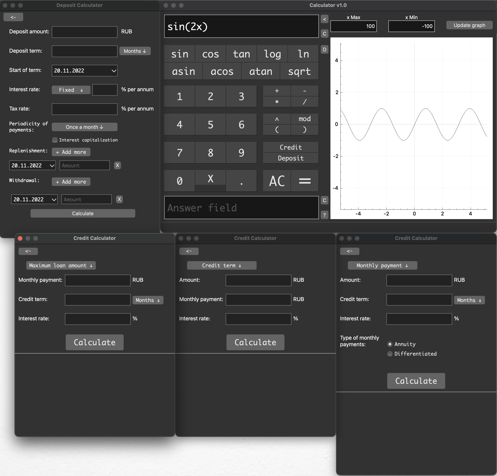

Introduction
============

This calculator can:

-   Calculates arbitrary bracket arithmetic expressions in infix
    notation.

-   Calculate expressions in scientific notation - *1e-7, 1e+7*

-   Plotting a function given by an expression in infix notation with
    the variable x.

-   In X, you can also substitute a number.

-   Support the following operands:

    1.  Unary plus *(+2)* and minus *(-2)*;

    2.  Regular plus *(+)* and minus *(-)*;

    3.  Multiplication *(\*)*, division *(/)* and remainder *(mod)*;

    4.  Power *(\^)* and Square Root - *sqrt()*;

    5.  Sine - *sin()*, Cosine - *cos()*, Tangent - *tan()*;

    6.  Arcsine - *asin()*, Arccosine - *acos()*, Arctangent - *atan()*;

    7.  Decimal logarithm - *log()*, Natural logarithm - *ln()*;

    8.  Brackets - *()* and *X*.

-   Also multiply by x - *2x*, or bracket - *2(2+2)*;

-   Calculate monthly loan payments, credit term, maximum loan amount
    and total overpayment;

-   Calculate accrued interest on the amount of your deposit, including
    compound interest,
    replenishments and withdrawals;

Installation
============

Before installation check dependencies

1.  Download project from repository;

2.  Open terminal and move to project;

3.  Type in terminal: **make install**;

4.  You can find the application on your Desktop or type also **make
    open**.

Usage
=====
- ## Basic:

    1. Open the application from the Desktop;

    2. Enter an expression in the *Input field* or press the buttons below it;

    3. Press **=** or **Enter** key, your answer will instantly appear in *Answer field*;

    4. Press **AC** to clear *Input field* and *Answer field* or you can press **C** buttons beneath this field to clear only one field.

- ## Function graph:

     1. Press **>** to see the graph of the functions;

     2. Enter the function in the *Input field* and press **Update graph**, your graph will be positioned on the set x-axis;

     3. Press **D** to set the default value(100, -100), also you can scale and move your graph;

     4. Press **<** to close the graph window.

- ## Credit calculator:
	 
	1. Press **Credit** button, then select the calculation and double-click it;

	2. **Monthly payment** allows you to calculate the monthly payment of a credit: 
		* Set the **amount** of credit, then set a **term** in months or years, set the **interest rate** and choose the type - **annuity** or **differential**, finally press **Calculate** and under the white line you will see **a list of monthly payments** for the whole term **in months**, **total overpayment** and **fully paid amount**;

 	3. **Credit term** allows you to know the term of the potential loan:
 		* Set the **amount** of potentional credit, then set the **monthly payment** you want to pay and the **interest rate**, at the end press **Calculate** and under the white line you will see the **term of loan**, **total overpayment** and **total payout**;
 	
 	4. **Maximum loan amount** allows you to find out the maximum loan amount depending on the monthly payment:
 		* Set the **monthly payment** you want to pay, then specify the **term of the loan** in months or years, set the **interest rate** and finally press **Calculate**, under the white line you will see the **total amount of loan** that you can take, the **total overpayment** and the **total payout**.

- ## Deposit calculator:
	1. Press **Deposit** button to open deposit calculator;

	2. Set the **amount** of the potential deposit;
	3. Set the **deposit term**;

	4. Select the **start date of the term**;

	5. Select the type of **interest rate**, where: 
		* **Fixed** is a rate for whole term;
		* **Depends on the term** is a rate that varies depending on the day of the deposit;
		* **Depends on the amount** is a rate which varies depending on the amount on the deposit;

	6. Set the **tax rate**, *the tax calculating according to the law of the Russian Federation from 2022;*

	7. Select the **periodicity of payments**;

	8. Select **capitalization**, if necessary;

	9. You can add **Replenishments** and **Withdrawals** from the deposit:
		* Press **Add more** button, then select the **date** of the transaction and its **amount**;

	10. At the end press **Calculate**, in the pop-up window you will see the **accrued interest**, the **tax** and the **amount on deposit at the end of the term**.

Uninstallation
==============

1.  Open terminal and move to project;

2.  Type in terminal: **make uninstall**;

3.  Move the project folder to trash.

Dependencies
============

1. Clang

2. GNU GCC/G++

3. Qt 6.2.3 framework

4. OpenGL

5. qmake6 

6. make 

### Created and tested on macOS
